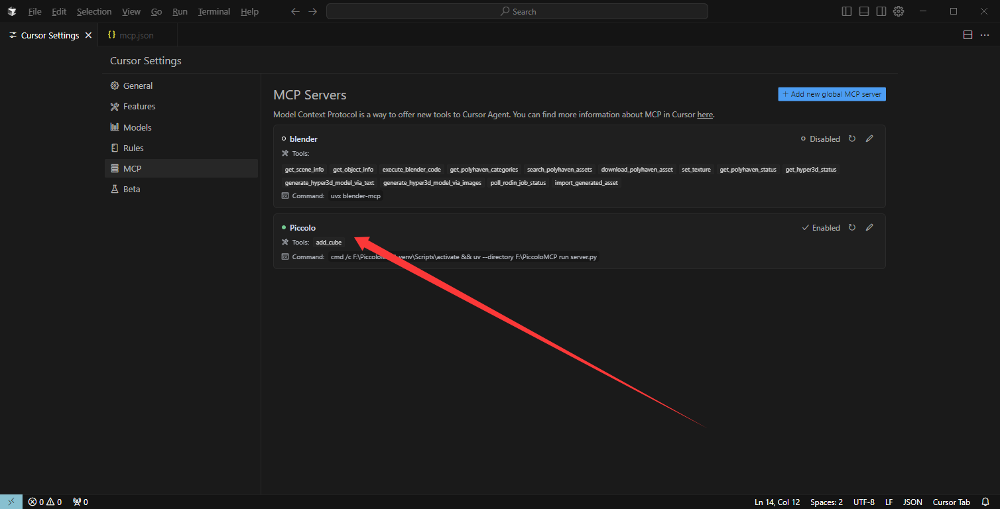

# MCP Server

This is an MCP server Client implementation that can be used for more than just the Piccolo engine.

# C++ Server

The python part is that the client can connect to the C++ simple server

> The C++ server uses boost and json11   
> You can create a C++ project to test it yourself 
# What is MCP

A protocol that enables LLM to interact directly with software

# Cursor Demo

